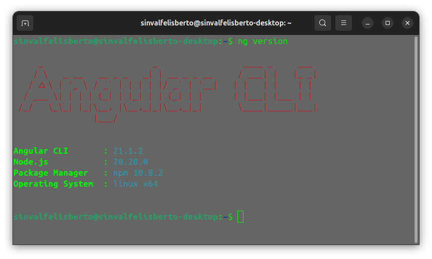

# 📝 Task List - Angular & JSON Server

Um aplicativo de gerenciamento de tarefas que utiliza **Angular** para o front-end e **JSON Server** para simular uma API REST completa com persistência de dados.

### Este projeto está disponível para estudo no canal do [YouTube da Crislaine D'Paula](https://www.youtube.com/watch?v=61QSKu2u5GU)

---

## 🚀 Funcionalidades

* **CRUD Completo:** Criar, Ler, Atualizar e Deletar tarefas.
* **Persistência de Dados:** As tarefas permanecem salvas no arquivo `db.json`, simulando um banco de dados real.
* **Interface Reativa:** Feedback instantâneo das ações do usuário através de componentes Angular.
* **Comunicação Assíncrona:** Uso de Services e HttpClient para interagir com a API.


## 🛠️ Tecnologias Utilizadas


* **Angular**: Framework principal para o desenvolvimento da SPA (Single Page Application).
* **JSON Server**: Ferramenta para criar uma API fake de forma rápida e eficiente.
* **TypeScript**: Tipagem estática para um código mais seguro e escalável.
* **RxJS**: Gerenciamento de fluxos de dados assíncronos.



---

## 🔧 Como Executar o Projeto

Para rodar este projeto, você precisará de dois terminais abertos: um para o servidor de dados (Backend) e outro para a interface (Frontend).

### 1. Preparação
```bash
# Clone o repositório
git clone [https://github.com/sinvalfelisberto/lista-tarefas-angular.git](https://github.com/sinvalfelisberto/lista-tarefas-angular.git)

# Acesse a pasta
cd lista-tarefas-angular

# Instale as dependências
npm install
```

### 2. Rodar o Backend (JSON Server)
O arquivo que servirá como banco de dados é o db.json.

```bash
# Usando npx para rodar sem necessidade de instalação global
npx json-server --watch db.json --port 3000
```
> O servidor deve estar rodando em http://localhost:3000 para que o Angular consiga consumir os dados.

### 3. Rodar o Frontend (Angular)
Em um novo terminal, execute:

```bash
ng serve
```
> Abra o navegador e acesse: http://localhost:4200/.

## 💡 Dicas de Uso: JSON Server

O JSON Server é uma ferramenta incrível para prototipagem. Aqui estão algumas dicas úteis para este projeto:

* Persistência Automática: Qualquer alteração feita via app (adicionar ou remover tarefa) é escrita instantaneamente no arquivo ```db.json```.

* Simular Latência de Rede: Para testar como o app se comporta com internet lenta (ex: exibir um loading), use o parâmetro ```--delay:```

```bash
npx json-server --watch db.json --delay 2000
```
* Filtros de URL: Você pode testar os dados diretamente no navegador. Por exemplo, para ver apenas tarefas concluídas: ```http://localhost:3000/tarefas?concluido=true```.

* Acesso via Celular: Se quiser testar o app no seu smartphone (estando na mesma rede Wi-Fi), inicie o server com:


```bash
npx json-server --watch db.json --host 0.0.0.0
```
## 📜 Licença
Este projeto está sob a licença MIT. Sinta-se à vontade para usar, estudar e modificar conforme suas necessidades.

```plaintext
MIT License

Copyright (c) 2024 Sinval Felisberto

Permission is hereby granted, free of charge, to any person obtaining a copy
of this software and associated documentation files (the "Software"), to deal
in the Software without restriction, including without limitation the rights
to use, copy, modify, merge, publish, distribute, sublicense, and/or sell
copies of the Software, and to permit persons to whom the Software is
furnished to do so, subject to the following conditions...
```

## Desenvolvido com ☕ por [Sinval Felisberto](https://github.com/sinvalfelisberto/)
